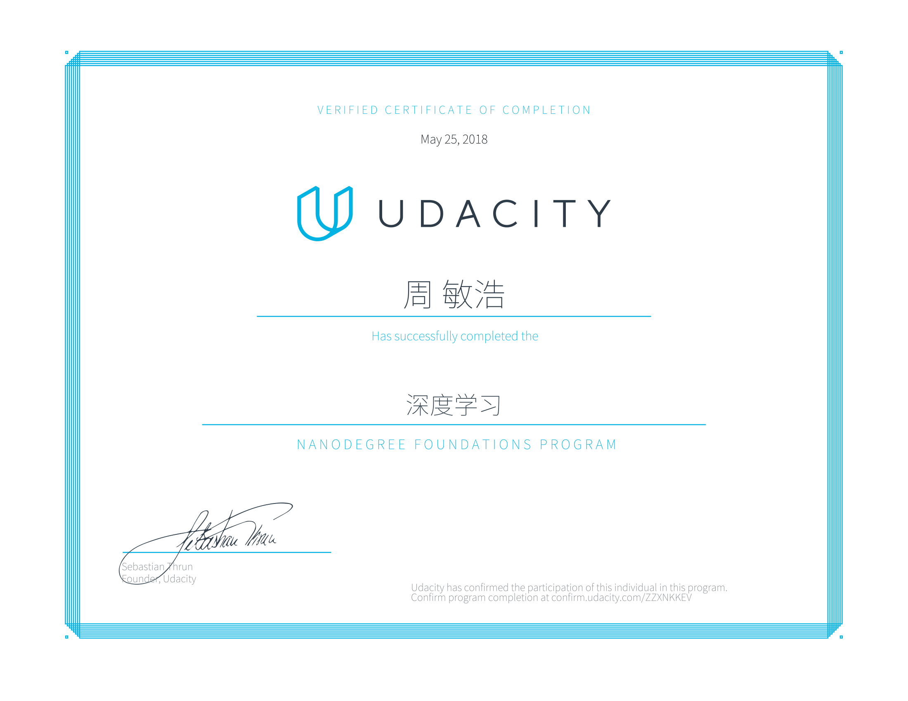

# **深度学习纳米学位**

卷积神经网络、循环神经网络、深度强化学习  

- [项目 --- 狗狗品种分类：卷积神经网络](https://nbviewer.jupyter.org/github/Peter-Chou/course-learn/blob/master/Projects/DLND_dog_classification/dog_app.ipynb)
- [项目 --- 生成电视剧剧本：循环神经网络](https://nbviewer.jupyter.org/github/Peter-Chou/course-learn/blob/master/Projects/DLND_tv_script_generation/tv_script_generation.ipynb)
- [项目 --- 生成人脸：生成对抗网络 GAN](https://nbviewer.jupyter.org/github/Peter-Chou/course-learn/blob/master/Projects/DLND_face_generation/dlnd_face_generation.ipynb)
- [项目 --- 指导四轴飞行器学会飞行](https://nbviewer.jupyter.org/github/Peter-Chou/course-learn/blob/master/Projects/DLND-Quadcopter/Quadcopter_Project.ipynb)

# **机器学习纳米学位 --- 已通过**

监督学习、非监督学习、强化学习、深度学习

- [项目 --- Python对波士顿房价进行预测： 决策树回归](http://nbviewer.jupyter.org/github/Peter-Chou/course-learn/blob/master/Projects/MLND_boston_housing/boston_housing.ipynb)
- [项目 --- Python寻找慈善机构潜在的捐款人： Adaboost](http://nbviewer.jupyter.org/github/Peter-Chou/course-learn/blob/master/Projects/MLND_finding_donors/finding_donors.ipynb) 
- [项目 --- Python对经销商数据对客户进行分类： 高斯混合聚类](http://nbviewer.jupyter.org/github/Peter-Chou/course-learn/blob/master/Projects/MLND_customer_segments/customer_segments.ipynb)
- [项目 --- Python训练智能出租车学会驾驶规则： 强化学习](http://nbviewer.jupyter.org/github/Peter-Chou/course-learn/blob/master/Projects/MLND_smartcab/smartcab.ipynb)
- [项目 --- TensorFlow对图像数据进行分类学习： 卷积神经网络](http://nbviewer.jupyter.org/github/Peter-Chou/course-learn/blob/master/Projects/MLND_image_classification/image_classification.ipynb)
- [项目 --- Python预测Rossmann药店日销售量： XGBoost](http://nbviewer.jupyter.org/github/Peter-Chou/course-learn/blob/master/Projects/MLND_Rossmann_Store_Sales/Rossmann_Store_Sales_Report.ipynb)

---

# **数据分析纳米学位 --- 已通过** 

数据清理、SQL、探索性数据分析、数据可视化

- [项目 --- Python分析泰坦尼克生存率的特征： Logistic回归](http://nbviewer.jupyter.org/github/Peter-Chou/course-learn/blob/master/Projects/DAND_TitanicAnalysis/Titanic_Survival_Analysis.ipynb)
- [项目 --- Python对免费试学筛选器的改进评估： A/B Test](http://nbviewer.jupyter.org/github/Peter-Chou/course-learn/blob/master/Projects/DAND_ABtest/AB_test.ipynb)
- [项目 --- Python对OpenStreetMap数据清理： XML / SQL](http://nbviewer.jupyter.org/github/Peter-Chou/course-learn/blob/master/Projects/DAND_OSM/openstreetmap.ipynb)
- [项目 --- R对红酒评分数据进行EDA分析： 有序Probit回归](http://nbviewer.jupyter.org/github/Peter-Chou/course-learn/blob/master/Projects/DAND_EDA/EDA.ipynb)
- [项目 --- Python机器学习并找出安然公司嫌疑人： 高斯朴素贝叶斯](http://nbviewer.jupyter.org/github/Peter-Chou/course-learn/blob/master/Projects/DAND_EnronAnalyssis/Enron_project.ipynb)
- [项目 --- 可视化棒球手表现的交互呈现： dimple.js / d3.js](http://bl.ocks.org/Peter-Chou/819e62ac1506866c9d66a4c69ea7dd83)

---

# **中国准精算师资格考试 --- 已通过** 

数理统计、利息理论、模型构建、风险管理、产品定价、准备金评估

